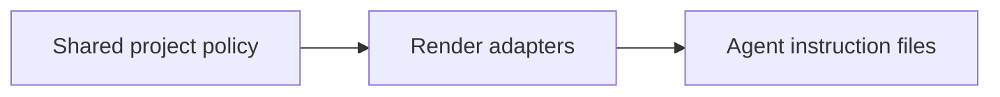

<!-- readme-refresh:start -->
<p align="center">
  <picture>
    <source media="(prefers-color-scheme: dark)" srcset="assets/readme-banner.png">
    <source media="(prefers-color-scheme: light)" srcset="assets/readme-banner.png">
    
  </picture>
</p>

<h1 align="center">🧩 RulePort</h1>

<p align="center"><strong>Generate portable instructions for multiple coding agents from one policy.</strong></p>

<p align="center">
  <a href="https://github.com/al1re3a/ruleport/actions/workflows/ci.yml"></a>
  <a href="https://nodejs.org/"></a>
  <a href="LICENSE"></a>
  <a href="https://github.com/al1re3a/ruleport/stargazers"></a>
  <a href="https://github.com/al1re3a/ruleport/issues"></a>
</p>

<p align="center">
  <a href="https://github.com/al1re3a/ruleport"></a>
  <a href="#quick-start"></a>
  <a href="CONTRIBUTING.md"></a>
  <a href="SECURITY.md"></a>
</p>

<p align="center">
  
</p>

> [!NOTE]
> Review generated diffs before committing them, especially when a target instruction file already exists.

## 📑 Contents

- [At a glance](#-at-a-glance)
- [Quick start](#quick-start)
- [Browser studio](#browser-studio)
- [Policy format](#policy-format)
- [CI drift check](#ci-drift-check)
- [Focused output](#focused-output)
- [Why RulePort](#why-ruleport)

---

## 🔎 At a glance

| | |
|---|---|
| **Purpose** | One project policy, portable instructions for Codex, Claude Code, Copilot, and Cursor. |
| **Input** | Shared project policy |
| **Output** | Agent instruction files |
| **Runtime** | Node.js 20+ |
| **CI** | ✅ Linux |
| **Status** | ✅ Maintained |

<details>
<summary><strong>🧭 How it works</strong></summary>



For long-running local sessions, press <kbd>Ctrl</kbd> + <kbd>C</kbd> to stop the process.

</details>

<details>
<summary><strong>📁 Repository layout</strong></summary>

```text
ruleport/
├── .github/
├── src/
├── test/
├── examples/
├── app/
├── package.json
├── index.html
└── README.md
```

</details>

<details>
<summary><strong>🤝 Contributors</strong></summary>

<br>
<a href="https://github.com/al1re3a/ruleport/graphs/contributors">
  
</a>

</details>
<!-- readme-refresh:end -->

**Write your project rules once. Port them to every coding agent.**

RulePort turns one small JSON policy into consistent instructions for:

- `AGENTS.md` (Codex and compatible agents)
- `CLAUDE.md` (Claude Code)
- `.github/copilot-instructions.md` (GitHub Copilot)
- `.cursor/rules/project.mdc` (Cursor)

Use the visual studio in a browser or automate it with the zero-dependency CLI. Your policy stays local either way.

## Quick start

```bash
npx ruleport --init
# edit ruleport.json
npx ruleport
```

RulePort writes all four targets while preserving the vocabulary and constraints in your source policy.

## Browser studio

```bash
git clone https://github.com/al1re3a/ruleport.git
cd ruleport
npm run dev
```

Open `http://127.0.0.1:4173`. Edit the policy and preview or download each target instantly. No data is uploaded.

## Policy format

```json
{
  "name": "My app",
  "summary": "What this repository does.",
  "stack": ["TypeScript", "React"],
  "commands": { "test": "npm test", "check": "npm run check" },
  "conventions": ["Prefer named exports."],
  "boundaries": ["Never commit secrets."],
  "verification": ["Run tests before finishing."],
  "scope": "**/*.{ts,tsx}"
}
```

See [`examples/ruleport.json`](examples/ruleport.json) for a complete policy.

## CI drift check

Commit `ruleport.json` and generated instructions, then ensure nobody edits outputs by hand:

```yaml
- run: npx ruleport --check
```

The command exits with code `2` when any generated file is missing or stale.

## Focused output

```bash
# Generate only Codex and Claude instructions
ruleport -t agents,claude

# Preview without writing
ruleport examples/ruleport.json --dry-run

# Generate into another repository
ruleport team-policy.json --out ../service-a
```

## Why RulePort

Agent instruction formats are multiplying, but project intent should have one source of truth. RulePort deliberately covers the portable core—project context, commands, conventions, boundaries, and verification—without hiding target-specific output behind a hosted service.

## Development

```bash
npm run check
npm run dev
```

Contributions are welcome, especially new target adapters, policy validation, and examples from real projects.

## License

MIT
